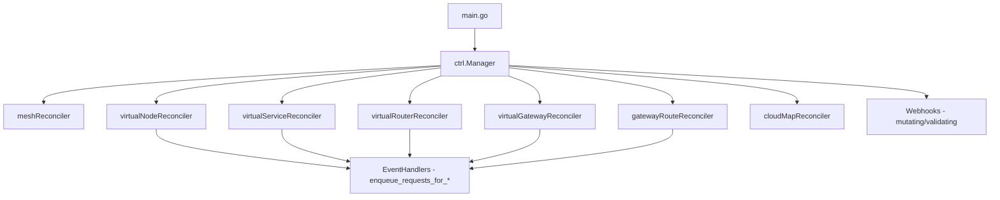

# Detailed Design: AppMesh Controller Dependency Upgrade

## Overview

Upgrade the `aws-app-mesh-controller-for-k8s` Go dependencies to address 6 pending Dependabot PRs, update the Kubernetes client libraries to support current EKS versions (1.30–1.35), and modernize the Go toolchain from 1.20 to 1.23.

This is a single atomic PR — intermediate states won't compile due to tightly coupled dependency trees and interface changes across controller-runtime versions.

## Detailed Requirements

1. **Single PR** containing all changes (no intermediate buildable states possible)
2. **Target versions**: Go 1.23, controller-runtime v0.20.x, k8s.io/\* v0.32.x
3. **Verification**: Unit tests + Docker build + full e2e on EKS 1.32
4. **AWS SDK v1**: Leave at v1.44.252 (no update)
5. **golang/mock**: Pin current version, regenerate mocks with same tool
6. **CI/GitHub Actions**: Update last, after local build is confirmed working
7. **go.mod `replace` directives**: Remove if deps resolve safely without them
8. **Existing test infra**: Available, no provisioning needed

## Architecture Overview

No architectural changes — this is a dependency upgrade. The controller's runtime architecture remains:



## Components and Interfaces

### 1. go.mod / go.sum

**Changes:**
- `go 1.20` → `go 1.23`
- `sigs.k8s.io/controller-runtime v0.14.6` → `v0.20.x`
- All `k8s.io/*` packages: `v0.26.x` → `v0.32.x`
- `golang.org/x/crypto`: `v0.21.0` → latest (≥v0.45.0)
- `golang.org/x/oauth2`: `v0.7.0` → latest (≥v0.27.0)
- `github.com/docker/docker`: `20.10.24` → `25.0.13`
- `helm.sh/helm/v3`: `v3.11.3` → `v3.14.3`
- `github.com/sirupsen/logrus`: `v1.9.0` → `v1.9.1`
- Remove `replace` directives (containerd, docker/distribution, runc)
- Add any new transitive dependencies required by controller-runtime v0.20

### 2. EventHandler Interface Migration (~12 files)

Files: `pkg/*/enqueue_requests_for_*_events.go`

**Before (v0.14):**
```go
func (h *handler) Create(e event.CreateEvent, queue workqueue.RateLimitingInterface) {
func (h *handler) Update(e event.UpdateEvent, queue workqueue.RateLimitingInterface) {
func (h *handler) Delete(e event.DeleteEvent, queue workqueue.RateLimitingInterface) {
func (h *handler) Generic(e event.GenericEvent, queue workqueue.RateLimitingInterface) {
```

**After (v0.20):**
```go
func (h *handler) Create(ctx context.Context, e event.CreateEvent, queue workqueue.RateLimitingInterface) {
func (h *handler) Update(ctx context.Context, e event.UpdateEvent, queue workqueue.RateLimitingInterface) {
func (h *handler) Delete(ctx context.Context, e event.DeleteEvent, queue workqueue.RateLimitingInterface) {
func (h *handler) Generic(ctx context.Context, e event.GenericEvent, queue workqueue.RateLimitingInterface) {
```

Affected packages:
- `pkg/virtualnode/` (3 handler files)
- `pkg/virtualservice/` (3 handler files)
- `pkg/virtualrouter/` (2 handler files)
- `pkg/virtualgateway/` (1 handler file)
- `pkg/gatewayroute/` (2 handler files)
- `pkg/cloudmap/` (1 handler file)

### 3. Controller `Watches()` API Migration (6 controllers)

**Before (v0.14):**
```go
Watches(&source.Kind{Type: &appmesh.Mesh{}}, r.enqueueRequestsForMeshEvents)
```

**After (v0.20):**
```go
Watches(source.Kind(mgr.GetCache(), &appmesh.Mesh{}, r.enqueueRequestsForMeshEvents))
```

Note: The new `Watches` takes a `source.Source` directly. `source.Kind` is now a function that returns a configured source. The handler is passed into the source constructor.

Affected controllers:
- `controllers/appmesh/virtualnode_controller.go`
- `controllers/appmesh/virtualservice_controller.go`
- `controllers/appmesh/virtualrouter_controller.go`
- `controllers/appmesh/virtualgateway_controller.go`
- `controllers/appmesh/gatewayroute_controller.go`
- `controllers/appmesh/cloudmap_controller.go`

### 4. Webhook Migration (admission.Defaulter/Validator removed in v0.20)

The codebase has its own `pkg/webhook/` abstraction with custom `Mutator` and `Validator` interfaces. These wrap controller-runtime's admission handling. Need to verify:
- Whether `pkg/webhook/mutating_handler.go` and `validating_handler.go` use the removed `admission.Defaulter`/`admission.Validator` interfaces, or if they use lower-level admission handling directly.
- If they use lower-level `admission.Handler` interface (likely), impact is minimal.

### 5. Test Framework (`client.NewDelegatingClient` removed)

File: `test/framework/framework.go`

**Before:**
```go
k8sClient, err := client.NewDelegatingClient(client.NewDelegatingClientInput{...})
```

**After:** Use `client.New()` with appropriate options, or the manager's client.

### 6. Mock Regeneration (~43 files)

Mocks in `mocks/` directory implement interfaces that are changing. After all interface updates:
1. Run `mockgen` to regenerate all mocks
2. Keep using `github.com/golang/mock` import path (pinned version)

### 7. Dockerfile

**Change:**
```dockerfile
FROM --platform=${BUILDPLATFORM} golang:1.23 as builder
```

### 8. GitHub Actions (`.github/workflows/`)

Update Go version references in CI workflow files. Done last after everything else works.

### 9. Custom Source (`pkg/k8s/custom_source.go`)

This file implements a custom `source.Source` for the notification channel pattern used by the CloudMap controller. May need interface updates if `source.Source` interface changed between versions.

## Data Models

No data model changes — this is purely a dependency/interface upgrade. All CRD types in `apis/appmesh/v1beta2/` remain unchanged.

## Error Handling

No changes to error handling strategy. The upgrade introduces `reconcile.TerminalError()` (available since v0.15) but we won't adopt it — existing error handling patterns remain.

## Testing Strategy

### Unit Tests
- All existing unit tests must pass after migration
- Mocks regenerated to match new interface signatures
- Run: `go test ./...`

### Build Verification
- `docker build .` succeeds with Go 1.23 base image
- Binary compiles for linux/amd64

### E2E Testing
- Deploy updated controller to EKS 1.32 cluster
- Run existing e2e test suite (`test/e2e/`)
- Run integration tests (`test/integration/`)
- Verify: mesh creation, virtual node/service/router/gateway CRUD, sidecar injection, CloudMap integration

## Appendices

### Technology Choices

| Decision | Choice | Rationale |
|----------|--------|-----------|
| Target k8s libs | v0.32 | Matches EKS 1.32 (extended support until March 2027) |
| Go version | 1.23 | Required by controller-runtime v0.20; k8s.io v0.32 |
| controller-runtime | v0.20.x | Latest that targets k8s 1.32 |
| Mock framework | Stay on golang/mock | Less churn; service sunsetting Sept 2026 |
| AWS SDK | Leave at v1.44 | Working, no security issue, minimize risk |

### Alternative Approaches Considered

1. **Option A (k8s 1.30, Go 1.22)** — Rejected: Go 1.22 already EOL
2. **Option B (k8s 1.31, Go 1.22)** — Rejected: Same Go EOL issue
3. **Option D (k8s 1.33+, Go 1.23+)** — Rejected: More effort than warranted for sunsetting service
4. **Multiple PRs** — Rejected: Intermediate states don't compile

### Key Constraints

- AppMesh service sunset: September 2026
- Changes must be atomic (single buildable PR)
- No architectural changes — mechanical upgrade only
- Existing e2e infra available for verification
