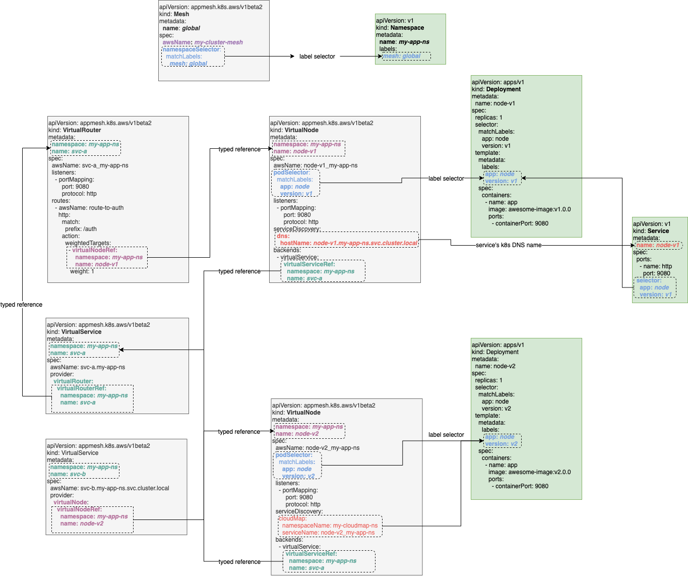

# AppMesh-K8s integration v1beta2 CRD API proposal

## Introduction

AppMesh is a service mesh product offered by Amazon. EKS team owns a controller that provides integration between AppMesh and Kubernetes using a [custom resource](https://kubernetes.io/docs/concepts/extend-kubernetes/api-extension/custom-resources/)(CRD) API.

This document proposes a new version(v1beta2) of CRD API to address issues in current API design(v1beta1).

## What is the problem

There are several issues in the old CRD API model. Details in [AppMesh-K8s integration API issues](https://github.com/aws/aws-app-mesh-controller-for-k8s/issues/146). In summary:

* The name of Kubernetes resources is tightly coupled with AppMesh names, which is inflexible and confusing.
* The references between Kubernetes resources is ambiguous and relies on string hacks.
* The security model for Kubernetes resources is not properly defined.
* The VirtualNode CRD is implicitly coupled with Deployment resource.
* The VirtualService cannot directly use VirtualNode as provider

## Why is it changing

We plan to announce k8s AppMesh controller as GA, and we should provide a stable and clean API for better customer experience.

## Out of scope

* The detailed implementation of new API is not discussed in this doc.

## Roles:

This document considers two user role:

* **Cluster Administrator:** The cluster administrator (ops) is responsible for administration of entire clusters. They manage the lifecycle of AppMesh mesh and provide them to application developers.
* **Application Developer**: The application developer (dev) is responsible for defining their application configuration and service composition.

## Use cases:

* As a Cluster Administrator for multi-tenant EKS cluster, I should be able to allocate a service mesh and control which users can create resources in this mesh.
* As an Application Developer, I should be able to define the service routing logic and backend configuration for my application without Cluster Administrator's intervention.

## Tenets:

* The API should follow [Kubernetes API conventions](https://github.com/kubernetes/community/blob/master/contributors/devel/sig-architecture/api-conventions.md)
* The API should be unambiguous, there should be only one obvious way for given task
* The API should be explicit instead of rely on implicit logic
* The API should be simple for 99% use case
* The API should be open for future extensions

## Design

### API overview

We’ll use four CRD to represent AppMesh objects:

* Mesh: Represents an AppMesh mesh object.
* VirtualNode: Represents an AppMesh virtualNode object.
* VirtualService: Represents an AppMesh virtualService object, which can use either VirtualRouter or VirtualNode as provider.
* VirtualRouter: Represents an AppMesh virtualRouter object and embeds virtualRoute.



Detailed changes are discussed below:

### Decouple k8s resource name from AppMesh resource name

Resource names for k8s resources should be decoupled from appMesh resource names. Users should be able to freely denote the resource name for k8s resources independently from appMesh resource names. **Sensible default for appMesh resource names can be derived from k8s resource name**.

1. Mesh resource have a field “**awsName**” to denote the AppMesh name for mesh. It defaults to be same as the name of mesh k8s resource.  

    Note: we may consider use other field name like “meshName”, “awsMeshName”. we choose “awsName” over simply “name” to avoid confusing.

    This enables use cases like use same resource name(e.g. “*global*”) for the k8s Mesh resource in different EKS clusters, while maps to different appMesh name.

    ```yaml
    apiVersion: appmesh.k8s.aws/v1beta2
    kind: Mesh
    metadata:
      name: global
    spec:
      awsName: my-cluster-mesh
    ```

1. VirtualService resource have a field “**awsName**” to denote the AppMesh name for VirtualService. It defaults to be  "$name.$namespace" of VirtualService k8s resource.

    Note: **the controller is responsible for detecting conflicting awsName with a mesh and report errors**.

    ```yaml
    apiVersion: appmesh.k8s.aws/v1beta2
    kind: VirtualService
    metadata:
      namespace: my-app-ns
      name: svc-a
    spec:
      awsName: svc-a.my-app-ns
    ```
    
    Alternative designs considered:
    
    1.  Enforce bind appMesh virtualServiceName to be VirtualService resource’s name. (**this is existing design used in our controller**)
        ```yaml
        apiVersion: appmesh.k8s.aws/v1beta1
        kind: VirtualService
        metadata:
            namespace: my-app-ns
            name: my-app-node.my-app-ns.svc.cluster.local
        spec:
            ...
        ```
        
        Pros:
        * the k8s namespace serves as a scope as a weak guarantee for uniqueness  of hostNames. (it’s weak guarantee since there can still be possible hostName conflicts for resources in multiple namespaces)
        
        Cons:
        * harder to extend to multiple hostName support
        * name of k8s resource tied to appMesh name

    1. have an array field “**hosts**” to denote the AppMesh names for VirtualService **For each host, we’ll transparently create an appMesh VirtualService object**. It defaults to have single entry of the VirtualService resource’s name.
        ```yaml
        apiVersion: appmesh.k8s.aws/v1beta2
        kind: VirtualService
        metadata:
          namespace: my-app-ns
          name: my-app-svc
        spec:
          hosts: 
          - my-app-svc.my-app-ns
          - my-app-svc.my-app-ns.svc.cluster.local
        ```
        
        Pros:
        * user friendly if multiple hostname for a service is desired. (under k8s, a pod can use multiple name to contact a service with the help of DNS search list).
        
        Cons:
        * not align with AppMesh API. (we decided not to do this unless appMesh itself supports such API).

1. VirtualNode resource can have a field “**awsName**” to denote the AppMesh name for VirtualNode. It defaults to be “**${name}_${namespace}**” of the VirtualNode resource.

    Note: we may consider use other field name like “virtualNodeName”, “awsVirtualNodeName”. we choose “awsName” over simply “name” to avoid confusing.

    Note: **currently controller use "-" as separator when build name, but we plan to change it to "_" to avoid conflicts with k8s's naming restrictions**.

    This enables use cases like have different app mesh VirtualNode under different context. e.g. for a mesh designated for a single EKS cluster, the default can be “*${name}_${namespace}*”. And for a mesh designated to be shared by multiple EKS clusters, the default can be “*${name}_${namespace}_${clusterName}*”. The naming pattern can be controlled by immutable attributes on mesh resource in the future(e.g. *spec.multiCluster*)

    ```yaml
    apiVersion: appmesh.k8s.aws/v1beta2
    kind: VirtualNode
    metadata:
      namespace: my-app-ns
      name: node-v1
    spec:
      awsName: node-v1_my-app-ns
    ```

### Use typed references to reference resources within cluster

we can use typed reference for relationship between resources within cluster.

1. use **virtualNodeRef** for reference from VirtualRouter to VirtualNode
    ```yaml
    apiVersion: appmesh.k8s.aws/v1beta2
    kind: VirtualRouter
    metadata:
      namespace: my-app-ns
      name: svc-a
    spec:
      awsName: svc-a_my-app-ns
      listeners:
        - portMapping:
            port: 9080
            protocol: http
      routes:
        - name: route-to-auth
          http:
            match:
              prefix: /auth
            action:
              weightedTargets:
                - virtualNodeRef:
                    namespace: my-app-ns # can be omitted if in same namespace as VirtualRouter
                    name: node-v1
                  weight: 1
    ```
    
    Alternative designs considered:

    1. use mangled name of k8s virtualNode resource. (**this is existing design used in our controller**)

        We can use a mangled name of virtualNode resource. like “*${nodeName}*” when referencing a virtualNode within current namespace and “*${nodeName}.${namespace}*” when referencing a virtualNode in another namespace.

        ```yaml
        weightedTargets:
        - virtualNodeName: colorteller.appmesh-demo
            weight: 4
        - virtualNodeName: colorteller-blue
            weight: 3
        - virtualNodeName: colorteller-black.appmesh-demo
            weight: 3
        ```
    
        Cons:
        * VirtualNodeName here is ambiguous. It’s referencing the name of k8s VirtualNode instead of appMesh VirtualNode.
        * It string hacks by whether there is a “.” inside and use it as name/namespace separator. while “.‘ is  valid to be part of name identifier in k8s.
        * It cannot be extended to support reference external virtualNode in mesh (like a ECS node)

    1. use the real name of  appMesh virtualNode.
        
        We can use the real name of appMesh virtualNode instead of mangled name of k8s object. The above example will be:

        ```yaml
        weightedTargets:
        - virtualNodeName: colorteller_appmesh-demo
            weight: 4
        - virtualNodeName: colorteller-blue
            weight: 3
        - virtualNodeName: colorteller-black_appmesh-demo
            weight: 3
        ```
        
        Pros: 
        * unambiguous supported both virtualNode in k8s and external like ECS.
        * simple implementation

        Cons:
        * users need to be aware of the name pattern of appMesh objects when want to reference a virtualNode created within cluster. however, it’s subject to change, e.g. we may include a cluster identifier in appMesh name as well if we plan to support multiple cluster.
        * not k8s native for reference between objects

1. [**optional, not planned**] **virtualNodeRef** can be extended to support resources outside of k8s cluster. e.g. a ECS virtual node.

    Note: we using field like “awsName” instead of “virtualNodeName” to avoid confusing, since “virtualNodeName” means “name for a k8s virtualNode resource” under k8s’s convention.

    ```yaml
    apiVersion: appmesh.k8s.aws/v1beta2
    kind: VirtualRouter
    metadata:
      namespace: my-app-ns
      name: svc-a
    spec:
      awsName: svc-a_my-app-ns
      listeners:
        - portMapping:
            port: 9080
            protocol: http
      routes:
        - name: route-to-auth
          http:
            match:
              prefix: /auth
            action:
              weightedTargets:
                - virtualNodeRef:
                    awsName: my-ecs-node
                  weight: 1
1. use **virtualServiceRef** for references from VirtualNode to VirtualService

    ```yaml
    apiVersion: appmesh.k8s.aws/v1beta1
    kind: VirtualNode
    metadata:
      namespace: my-app-ns
      name: my-app-node
    spec:
      ...other fileds...
      backends:
        - virtualService:
            virtualServiceRef:
              namespace: my-app-ns # can be omitted if in same namespace as VirtualNode
              name: my-app-svc
    ```
    
    Alternative designs considered:

    1. use the real name of appMesh virtualService. (**this is existing design used in our controller**)

        We can use the real name of appMesh virtualService when referencing it in nodes.
        
        Pros:
        * unambiguous supported both virtualService in k8s and external like ECS.
        * simple implementation
        
        Cons:
        * not k8s native for reference between objects
        * not consistent with how we reference nodes from services.

1. [**optional, not planned**] **virtualServiceRef** can be extended to support resources outside of k8s cluster. e.g. a ECS virtual service.

    Note: we are using field like “awsName” instead of “virtualServiceName” to avoid confusing, since “virtualServiceName” means “name for a k8s virtualService resource” under k8s’s convention.

    ```yaml
    apiVersion: appmesh.k8s.aws/v1beta1
    kind: VirtualNode
    metadata:
      namespace: my-app-ns
      name: my-app-node
    spec:
      ...other fields...
      backends:
        - virtualService:
            virtualServiceRef:
              awsName: "my-ecs-service"
    ```

### Decouple VirtualRouter from VirtualService

In AppMesh a **VirtualService** can use either VirtualRouter or VirtualNode as provider. VirtualRouter is only need when L7 routing functionality is needed.

We’ll create a new CRD named **VirtualRouter**, which represents AppMesh VirtualRouter object and embeds multiple AppMesh VirtualRoute objects.

```yaml
apiVersion: appmesh.k8s.aws/v1beta2
kind: VirtualRouter
metadata:
  namespace: my-app-ns
  name: svc-a
spec:
  awsName: svc-a_my-app-ns
  listeners:
    - portMapping:
        port: 9080
        protocol: http
  routes:
    - name: route-to-auth
      http:
        match:
          prefix: /auth
        action:
          weightedTargets:
            - virtualNodeRef:
                namespace: my-app-ns
                name: node-v1
             weight: 1
```

Note: The additional hierarchy of "virtualRouter" and "virtualNode" in addition to "virtualRouterRef" and "virtualNodeRef" is to align with AppMesh API(so that additional attributes specific to provider can be added easily).

* VirtualService can reference virtualRouter as provider:
    ```yaml
    apiVersion: appmesh.k8s.aws/v1beta2
    kind: VirtualService
    metadata:
      namespace: my-app-ns
      name: svc-a
    spec:
      hosts:
        - svc-b.my-app-ns.svc.cluster.local
      provider:  
        virtualRouter:
          virtualRouterRef:
            namespace: my-app-ns
            name: svc-a-router
    ```
* VirtualService can reference virtualNode as provider:
    ```yaml
    apiVersion: appmesh.k8s.aws/v1beta2
    kind: VirtualService
    metadata:
      namespace: my-app-ns
      name: svc-b
    spec:
      hosts:
        - svc-a.my-app-ns.svc.cluster.local
      provider:
        virtualNode:
          virtualNodeRef:
            namespace: my-app-ns
            name: node-v2
    ```

### Use selector on Mesh to denote mesh membership for resources within namespaces

Meshes should be set up by cluster administrator, they can use a selector to designate the mesh membership for resources in different k8s namespaces.

Note: **The label selectors of two mesh must not overlap. Controller should error if detected conflicting meshes for given resource.**

Initially, we can assume all resources in a single namespace will always belong to same mesh, so we only need **namespaceSelector** on **Mesh** resource. **namespaceSelector follows standard label selector semantics, if presents not empty, it selects all namespaces.**

This also enables use cases like share a AppMesh application configuration since the application specific configuration(virtualNode / virtualService) no longer rely on specific mesh presents.

```yaml
apiVersion: appmesh.k8s.aws/v1beta2
kind: Mesh
metadata:
  name: global
spec:
  namespaceSelector:
    matchLabels:
      mesh: my-mesh
---
apiVersion: v1
kind: Namespace
metadata:
  name: my-app-ns
  labels:
    mesh: my-mesh
```

[**optional, not planned**] If we need to support resources in a single namespace to belong to different meshes, we can extend above to have a **resourceSelector** to match labels on resources like VirtualService and VirtualNode in addition to the namespaceSelector.

```yaml
apiVersion: appmesh.k8s.aws/v1beta2
kind: Mesh
metadata:
  name: my-mesh
spec:
  namespaceSelector:
    matchLabels:
      mesh: my-mesh
  resourceSelector:
    matchLabels:
      mesh: my-mesh
```

Alternative designs considered:
1. Use **meshName** on resources to denote mesh membership. (**this is existing design used in our controller**)

    Currently we are using a meshName on resources to denote mesh membership. 

    ```yaml
    apiVersion: appmesh.k8s.aws/v1beta1
    kind: VirtualService
    metadata:
      namespace: my-app-ns
      name: my-app-svc
    spec:
      meshName: my-mesh
      ...other fields...
    ```
    
    Pros:
    * enforced that a resource can only belong to a single mesh. 
    * simple implementation for lookup mesh based on resource. since the meshName is included on resources directly.

    Cons:
    * poor security model. a less privileged user limited within namespace can create resources into mesh freely. 
    * requires user to set meshName on every resource even within a namespace.

1. Use annotation on namespaces to denote mesh membership.

    We can use annotations on namespaces to denote mesh membership.

    ```yaml
    apiVersion: v1
    kind: Namespace
    metadata:
      name: my-app-ns
      annotations:
        appmesh.k8s.aws/mesh-name: my-mesh
    ```

    Pros: 
    * enforced that a resource in a namespace can only belong to a single mesh
    * simple implementation for lookup mesh based on resource. since the meshName is included on resources’s namespace directly.

    Cons:
    * not Kubernetes native. The Kubernetes native way is to use label selector to denote membership.
    * not possible for extensions like for a single namespace into multiple meshes in the future.

1. Use an array of selectors instead of a single one on mesh resource.

    Selectors among selectors array are “**OR**” relationship. And within a selector it’s **AND** relationship(e.g. resources must match both namespaceSelector & resourceSelector to be member of the mesh)

    ```yaml
    apiVersion: appmesh.k8s.aws/v1beta2
    kind: Mesh
    metadata:
      name: my-mesh
    spec:
      selectors:
      - namespaceSelector:
          matchLabels:
            mesh: my-mesh
      - namespaceSelector:
          matchLabels:
            my-mesh: "true"
        resourceSelector:
          matchLabels:
            my-mesh: "true"
    ```
    
    Pros:
    * let user freely define selectors for different use cases.

    Cons:
    * over complicated for simple use cases. users should be properly organize their labels to achieve similar effect even under the single selector proposal.

### Use selector on VirtualNode to denote node membership

We use a podSelector to match pods that should be member of virtualNode. Note, we don’t use a namespace selector here since we want to enforce pods are in same namespace of virtualNode resource.

The label selectors of two virtualNode within namespace must not overlap. Controller should error if detected conflicting virtualNode for given pod.

The injector will be changed to work using following logic:
1. for each pod created, it match against all virtualNode’s selector within namespace.
2. If it finds a single match, injects according to virtualNode’s mesh and name.
3. If it finds multiple match, it reports error.
4. The global "*APPMESH_NAME*" environment variable on injector deployment and annotation "*appmesh.k8s.aws/mesh*" and "*appmesh.k8s.aws/virtualNode*" annotation on pod will no longer be supported.

```yaml
apiVersion: appmesh.k8s.aws/v1beta1
kind: VirtualNode
metadata:
  namespace: my-app-ns
  name: my-app-node
spec:
  ...other fields...
  podSelector:
    matchLabels:
      app: my-app-node
---
apiVersion: apps/v1
kind: Deployment
metadata:
  namespace: my-app-ns
  name: my-app-node-deployment
spec:
  selector:
    matchLabels:
      app: my-app-node
  replicas: 5
  template:
    metadata:
      labels:
        app: my-app-node
    spec:
      containers:
      - name: app
        image: awesomeimage:v1.0.0
        ports:
        - containerPort: 80
```

Alternative designs considered:

1. The injector use an environment variable for default mesh name and allow override per pod with annotation `appmesh.k8s.aws/mesh`. Also,  the virtualNodeName is derived from pod’s replicaSet’s deployment name and allows override per pod with annotation `appmesh.k8s.aws/virtualNode` (**this is existing design used in our controller**)

    Pros:
    * easy to implement since all information is on pod itself.

    Cons:
    * The default behavior to resolve mesh relies on the fact that there is only one mesh in cluster, which conflicts with our multiple mesh per cluster support.
    * The default behavior to resolve virtualNode is not k8s native. it implies pods are managed by replicaSets then by deployments, which is tricky and not always true.
    * the annotations are intrusive to user’s application.